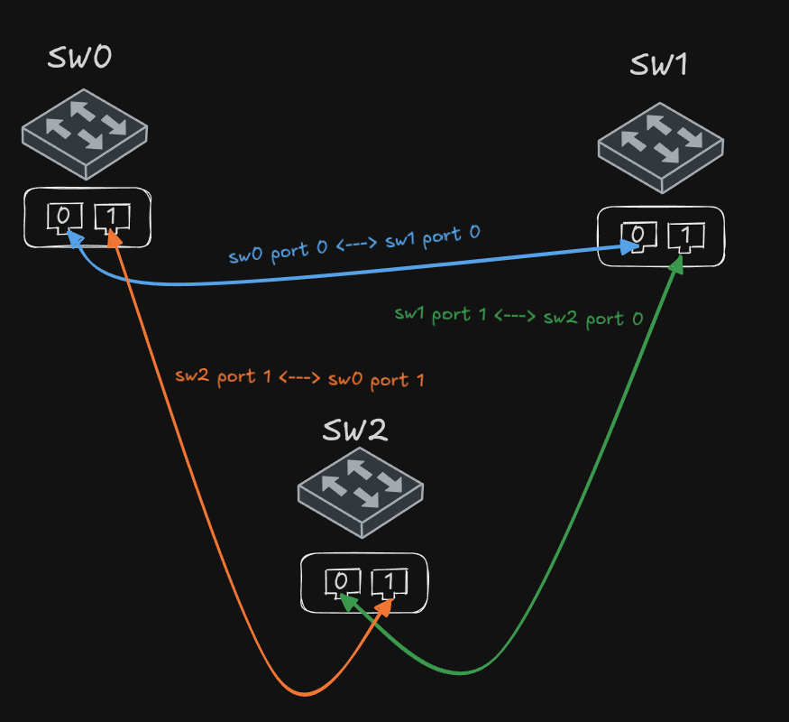
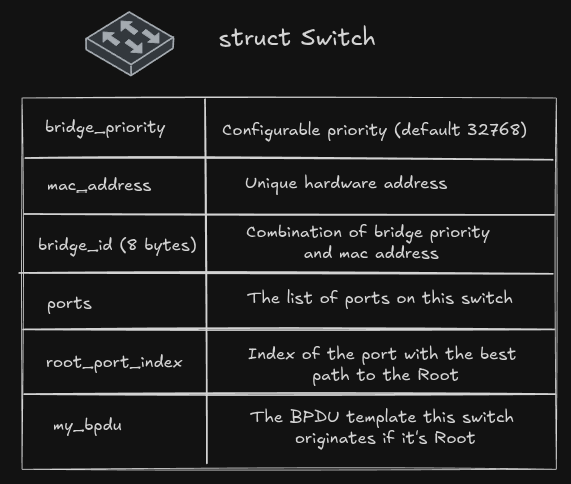
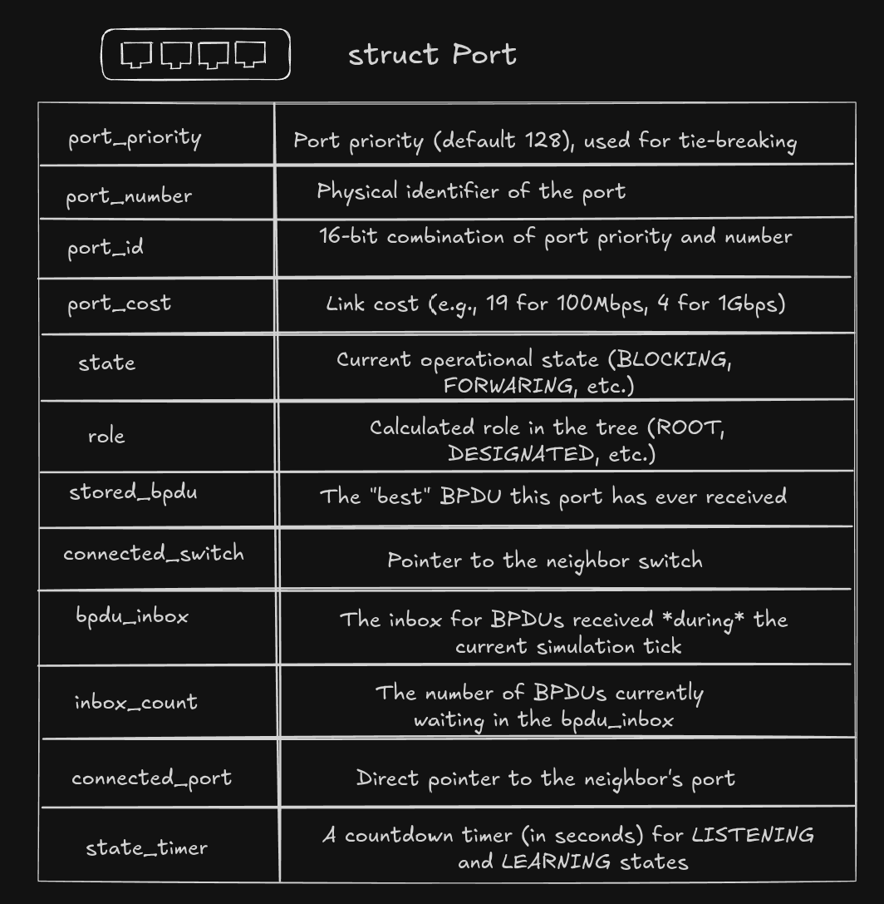
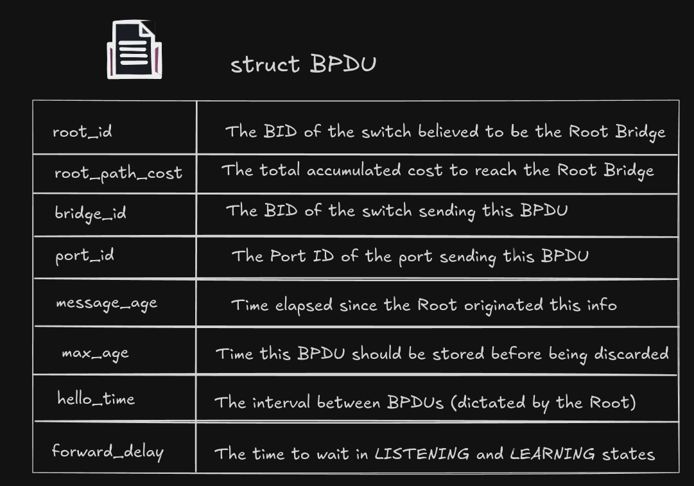
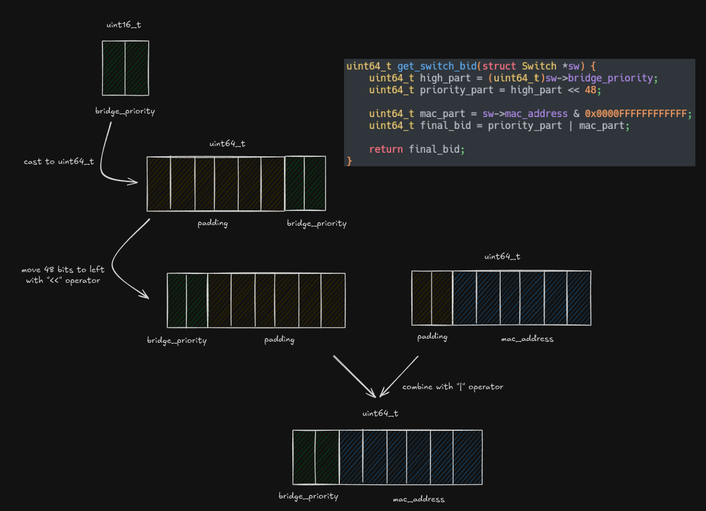

# STP (Spanning Tree Protocol) Simulator in C

A text-based simulator for Spanning Tree Protocol (STP) that I built in C to understand how it works. This project simulates the core logic: electing a Root Bridge, blocking ports to prevent loops, and handling all the state transitions.

## Features

- **Root Bridge Election:** Correctly elects the switch with the lowest Bridge ID (Priority + MAC) as the Root.
- **Port Role Selection:** Assigns correct roles (ROOT, DESIGNATED, NON_DESIGNATED) to all ports in the topology.
- **Loop Prevention:** Identifies and blocks redundant links by setting ports to the `BLOCKING` state.
- **State Machine:** Simulates the port state transitions (`BLOCKING` -> `LISTENING` -> `LEARNING` -> `FORWARDING`) with correct 15-second timers.
- **Real-time Feedback:** Prints a detailed network status report to the console every "tick" (second) of the simulation.

## Simulated Topology

The simulation builds the following 3-switch network, connected in a triangle to create a physical loop. This is the classic topology for testing STP's loop-prevention capabilities.



## How to Build and Run

This project uses `make` for easy compilation.

```bash
# compile and run the simulation
make run
# remove the compiled executable and object files
make clean
```

You will see a real-time log in your terminal showing the simulation ticks, port state changes, and the final converged network status.

## Components

The simulation is build on three core components:

### Switch

Represents a network Switch (or Bridge) running STP.



### Port
Represents a physical port on a switch.



### BPDU
Represents a Bridge Protocol Data Unit (BPDU).




## How it Works

The simulation runs in an infinite while(1) loop inside main.c. Each iteration of the loop represents one "tick" (one second) and executes the five core phases of the protocol:

- `send_all_bpdus()`: Sends BPDUs from Root/Designated ports.
- `process_all_bpdus()`: Each port reads its "inbox" and saves the best BPDU it has ever seen (`stored_bpdu`).
- `elect_all_port_roles()`: The "brain." Each switch re-evaluates its role (Root or Non-Root), elects its Root Port, and decides the `DESIGNATED` or `NON_DESIGNATED` (blocking) role for all other ports.
- `update_all_port_states()`: The "engine." This function acts on the roles, starting the 15-second `Forward Delay` timers to move ports from `BLOCKING` to `FORWARDING`.
- `print_network_status()`: A helper function that prints a "snapshot" of the entire network's state after each tick.


